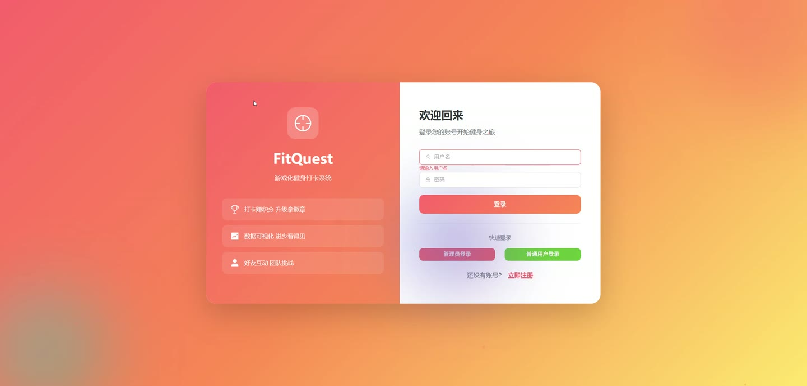
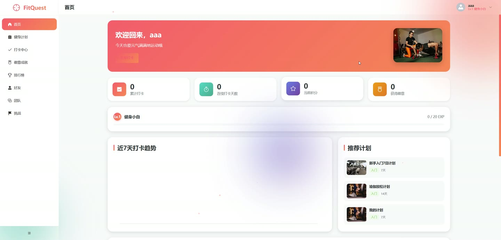
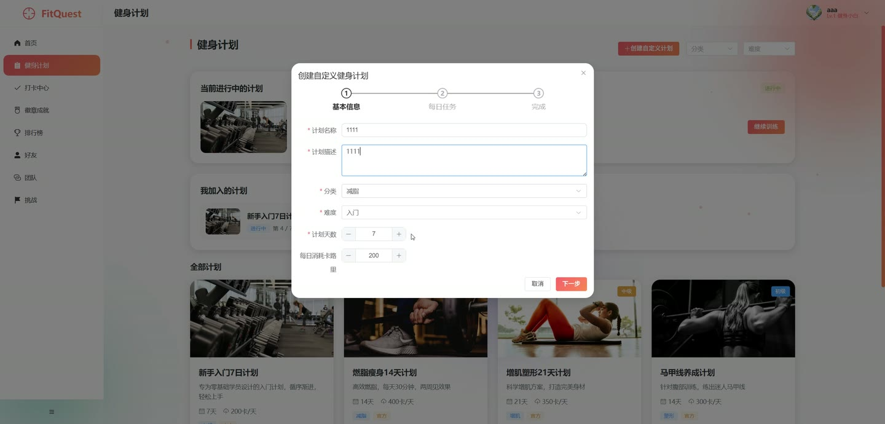
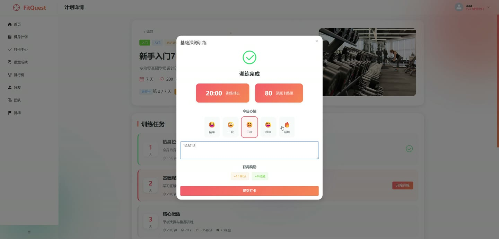
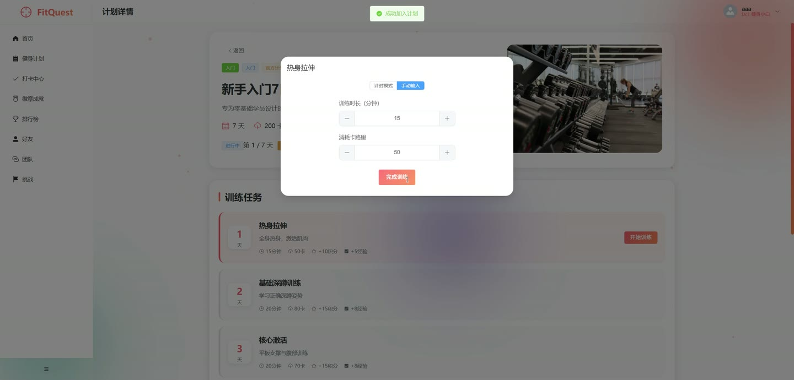
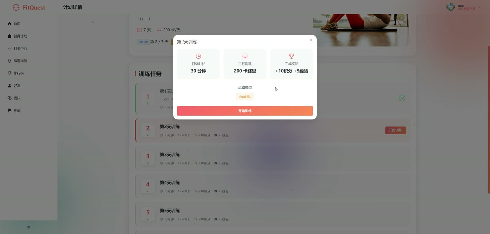

# (附文档)Springboot3+Vue3+MySQL 游戏化健身打卡系统

**技术栈**：Springboot3、Vue3、MySQL

### 系统简介

本系统是一套基于 Spring Boot 3 + Vue 3 + MySQL 的游戏化健身打卡系统，采用前后端分离架构。系统包含普通用户端、管理员端两大角色，通过积分、等级、徽章、成就、团队挑战等游戏化机制激励用户坚持健身打卡。支持自定义健身计划、每日打卡记录、好友社交、团队协作、数据大屏展示等完整功能闭环。
 
### 核心功能
 
### 普通用户端

 
- 注册/登录：通过用户名密码注册新账号，登录后获取 JWT Token 用于后续接口鉴权 
- 个人资料管理：查看和修改个人资料（昵称、邮箱、手机号、头像），头像支持图片文件上传 
- 每日健身打卡：选择运动类型、输入运动时长（分钟）和消耗卡路里，填写心情和备注，上传运动图片完成打卡 
- 打卡结果展示：打卡后即时返回获得的基础积分（10分起）、基础经验（5点起），运动超30分钟或消耗超200卡路里获额外奖励 
- 连续打卡统计：查看今日是否已打卡，系统自动记录连续打卡天数、总打卡次数，连续打卡天数突破历史最高值自动更新 
- 打卡日历：按年月查看打卡日历，日历上标记已打卡的日期，展示当月打卡总数和月度天数 
- 打卡记录列表：分页查看个人历史打卡记录，按时间倒序排列 
- 打卡统计图表：查看近7天打卡趋势统计，以及各运动类型的分布统计 
- 健身计划浏览：分页查看系统推荐的健身计划列表，支持按分类和难度筛选 
- 智能计划推荐：根据用户历史数据获取个性化推荐计划（默认推荐4条） 
- 加入健身计划：选择计划加入，系统记录计划进度（当前天数），每日打卡自动推进计划天数 
- 查看我的计划：查看已加入的所有计划列表，以及当前正在进行的计划 
- 计划任务管理：查看计划下的具体任务列表，支持创建、修改、删除自定义任务 
- 创建自定义计划：用户自行创建健身计划，填写计划名称、分类、难度、描述，并添加任务列表 
- 完成/放弃计划：手动标记计划为已完成或已放弃 
- 重置计划进度：重置指定计划的当前天数为第1天，并删除该计划下的所有打卡记录 
- 删除自定义计划：用户删除自己创建的非系统计划 
- 个人仪表盘：概览个人用户信息、近7天打卡趋势、运动类型分布、今日打卡状态、已获得徽章数/总徽章数 
- 等级与经验：系统根据经验值自动升级，用户可查看所有等级配置（等级序号、所需经验、等级名称） 
- 积分排行榜：查看全站用户按总积分排名的榜单（默认前10名） 
- 打卡次数排行榜：查看全站用户按总打卡次数排名的榜单（默认前10名） 
- 等级排行榜：查看全站用户按等级排名的榜单（默认前10名） 
- 个人统计数据：查看个人总积分、总经验、等级、总打卡数、连续打卡数、最大连续打卡数等统计 
- 好友管理：查看好友列表、发送好友请求（按用户ID或用户名搜索）、接受/拒绝好友请求、删除好友 
- 团队浏览：分页查看所有团队列表，查看团队详情和团队成员列表 
- 创建团队：创建新团队，填写团队名称、描述、最大人数，创建者自动成为队长 
- 加入/退出团队：申请加入团队，或退出已加入的团队 
- 解散团队：队长解散自己创建的团队 
- 我的团队：查看当前用户加入的所有团队 
- 团队排行榜：查看按团队总积分排名的榜单（默认前10名） 
- 挑战列表：分页查看所有挑战，支持按状态筛选（进行中/已完成） 
- 创建挑战：创建新的团队挑战，设置目标值、积分奖励等，创建者自动加入 
- 加入/退出挑战：参与公开挑战，或退出已参与的挑战（创建者不能退出只能删除） 
- 挑战打卡：在挑战中打卡，按进度值推进，每次打卡获得积分奖励（至少5分，按进度/2计算） 
- 挑战详情与参与者：查看挑战详情及参与者列表，按进度降序排列 
- 修改/删除挑战：创建者可以修改挑战信息或删除挑战 
- 我的挑战：查看当前用户参与的所有挑战 
- 徽章系统：查看所有可获得的徽章列表，以及个人已获得的徽章及获得时间 
- 成就系统：查看所有成就列表，个人成就进度和完成状态，手动同步成就进度 
- 文件上传：通用文件上传接口，支持任意文件类型，返回可访问的文件URL
 
### 管理员端

 
- 用户管理：分页查看所有用户列表，支持按用户名/昵称模糊搜索，按创建时间倒序 
- 用户状态管理：启用或禁用用户账号（禁用后无法登录） 
- 用户信息编辑：修改用户的昵称、角色、状态、等级、经验、积分、邮箱、手机号 
- 新增用户：手动创建新用户，设置初始密码（默认123456），可指定等级、经验、积分等初始值 
- 删除用户：永久删除指定用户账号 
- 健身计划管理：分页查看所有计划列表，创建系统计划，编辑计划信息，软删除计划（设置状态为0） 
- 徽章管理：查看所有徽章列表，创建新徽章，编辑徽章信息，删除徽章 
- 成就管理：查看所有成就列表，创建新成就，编辑成就信息，删除成就 
- 团队管理：查看所有团队列表，创建团队，编辑团队信息，删除团队 
- 挑战管理：查看所有挑战列表，创建挑战，编辑挑战信息，删除挑战 
- 等级配置管理：查看所有等级配置（按等级升序），创建新等级，编辑等级经验要求，删除等级 
- 管理员仪表盘：查看总用户数、活跃用户数、总计划数、总团队数、总打卡数、今日打卡数 
- 近7天打卡趋势：以图表形式展示最近7天每日打卡数量 
- 积分TOP5用户：查看全站积分最高的前5名用户 
- 数据大屏：展示总用户数、总打卡数、总团队数、活跃挑战数，近30天打卡趋势，积分/打卡/团队排行榜，热门计划
 
### 技术栈

 后端框架Spring Boot 3.x ORMMyBatis-Plus 权限认证Spring Security + JWT 前端框架Vue 3 状态管理Vue Router / Pinia (推测) 构建工具Vite (推测) 数据库MySQL 文件存储本地文件系统
 
### 交付内容

 
- 后端完整源码 
- 前端完整源码 
- 数据库初始化脚本 
- 万字文档

## 界面展示

---

## 获取完整源码 + 万字文档

本仓库为项目介绍页。**完整前后端源码、数据库初始化脚本、万字项目文档**，请加微信 `kangkangcode`，或访问 [codekk.top](http://codekk.top) 获取。

可作课程设计 / 毕业设计参考，支持远程部署调试。